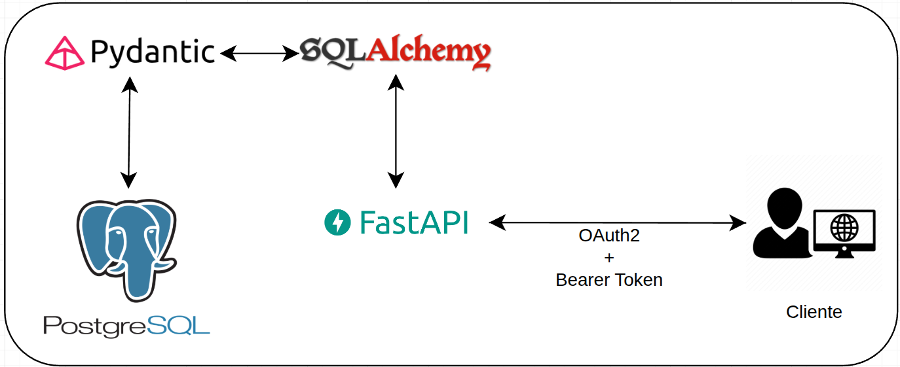

# Desafio Técnico - Desenvolvedor Backend Sênior | Iplan Rio

## Contexto

A Prefeitura do Rio de Janeiro quer oferecer aos cidadãos uma **API de Carteira Digital**, onde os usuários poderão armazenar e gerenciar documentos digitais, consultar e carregar créditos do transporte público e acessar serviços municipais via chatbot.  

Seu desafio será desenvolver uma API para essa carteira digital, simulando as interações do usuário com documentos e transporte público.

## Pipeline *backend*

## Iniciando o repositório
