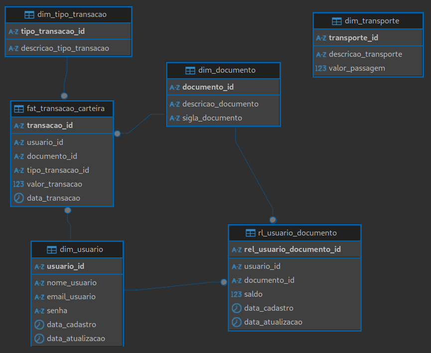

# Desafio Técnico - Desenvolvedor Backend Sênior | Iplan Rio

<div style="text-align: center;">

</div>

## API Carteira Digital

Seja bem vindo a fase de teste da API da Carteira Digital, uma aplicação responsável por centralizar diferentes documentos do cidadão, realizar recargas de cartões de benefícios e também consultar saldo do vale transporte, tudo em tempo real! 😲  

Para testar é preciso ter usuário e senha, mas não se preocupe! Por ser gratuito, todos podem fazer o cadastro e avaliar essa aplicação!  

## Como a aplicação funciona

<div style="text-align: center;">

</div>


## Vamos fazer um teste?

### Iniciando o repositório

1. 👨‍💻 Clone o repositório:  
`git clone https://github.com/jeantorre/desafio-senior-backend-developer`

2. 👩‍💻 Vá até o repositório:  
`cd desafio-senior-backend-developer`

### Inicializando a aplicação

Primeiro é necessário garantir que esteja rodando o [Docker Desktop](https://www.docker.com/products/docker-desktop/) em segundo plano.  

Sabia que neste momento já foram criados dois ambientes? 🤔  
O de *desenvolvimento* e o de *produção*. São bancos de dados distintos, com usuários e portas de acesso também separada, garantindo ambientes seguros para suas propostas.

Veja a diferença e escolha o que faz mais sentido neste momento:

* Desenvolvimento - um ambiente para testar e desenvolver novas funcionalidades, *endpoints* e o que mais desejar. Com um *reload* automático, as alterações no código já refletem na aplicação.  
Possui uma inserção automática de usuários, tipos de transporte, tipos de transação e alguns documentos e suas relações com usuários teste, sendo possível já testar os *endpoints* bastando apenas fazer o login para ter acesso ao token. E não se preocupe com qualquer alteração que fizer, a exclusão e reinclusão dos dados no banco é feita sempre que existe uma mudança no código!  

* Produção - ambiente onde as inserções de dados como usuários e as associações de documentos entre eles precisa ser feita de forma manual pelo usuário final. As informações inseridas e todas suas alterações são mantidas no banco.


Os comandos a seguir precisam ser realizados na raíz do projeto.  

| Comandos | Desenvolvimento | Produção |
| - | - | - |
| Inicialização | ./scripts/start-dev.sh | ./scripts/start-prod.sh |
| Encerramento | ./scripts/stop-dev.sh | ./scripts/stop-prod.sh |

### Acessando o banco de dados

Escolha o gerenciador de banco de sua preferência e configure da seguuinte maneira:  

- Banco para conexão: PostgreSQL

| Configurações | Desenvolvimento | Produção |
| - | - | - |
| Host | localhost | localhost |
| Database | db-desafio-dev | db-desafio-prod |
| Porta | 5433 | 5434 |
| Usuário | usuario_dev | usuario_prod |
| Senha | dev123 | prod123 |

#### Diagrama Entidade-Relacionamento
<div style="text-align: center;">

</div>

### Acessando os *endpoints*

É possível testá-los em ferramentas específicas que interagem com API ou diretamente pela documentação da API. Além disso também são encontradas todas as descrições de cada *endpoint* e suas respectivas variáveis.

|  | Desenvolvimento | Produção |
| - | - | - |
| Local de teste | http://localhost:8090/docs/ | http://localhost:8091/docs/ |

No ambiente de desenvolvimento já é criado usário de teste de forma automática, com as seguintes credenciais no *endpoint* `/auth/login`:

- username: teste1@teste.com
- password: teste1234

Como resposta são retornados bearer tokens, onde:
``` json
{

  "token_acesso": "token_que_expira_em_30_minutos",
  "token_refresh": "token_que_expira_em_7_dias",
}
```

Apenas os *endpoints* `/auth/login` e `/usuario/registrar` podem ser utilizados sem o token de acesso. Todos os outros é preciso autorização que pode ser passada na documentação ou na ferramenta de interação com API de sua escolha como "Bearer Token".  

Toda a documentação relacionada aos *endpoints* é localizada n
